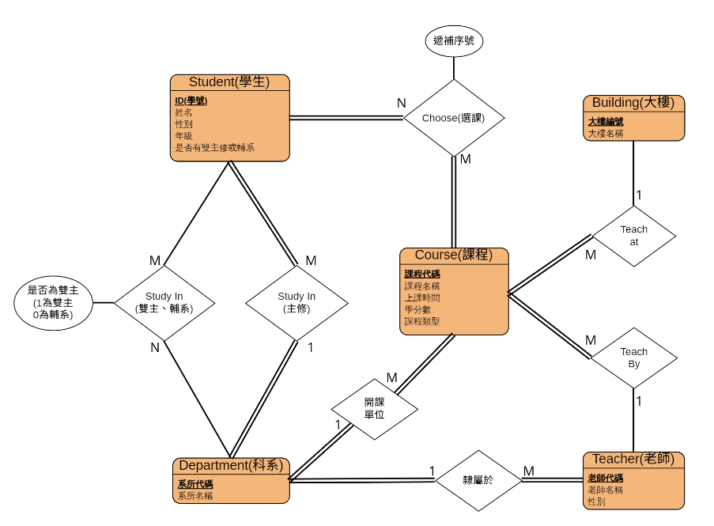
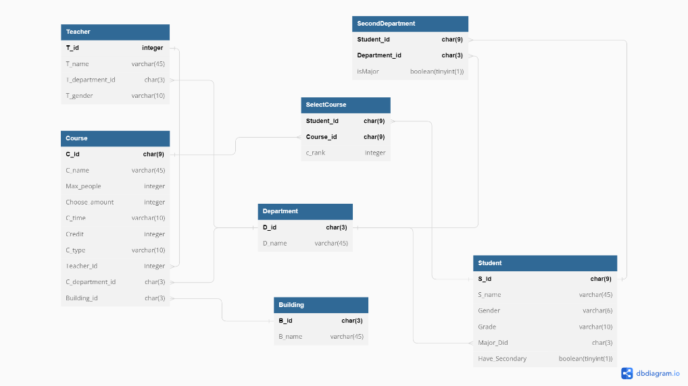
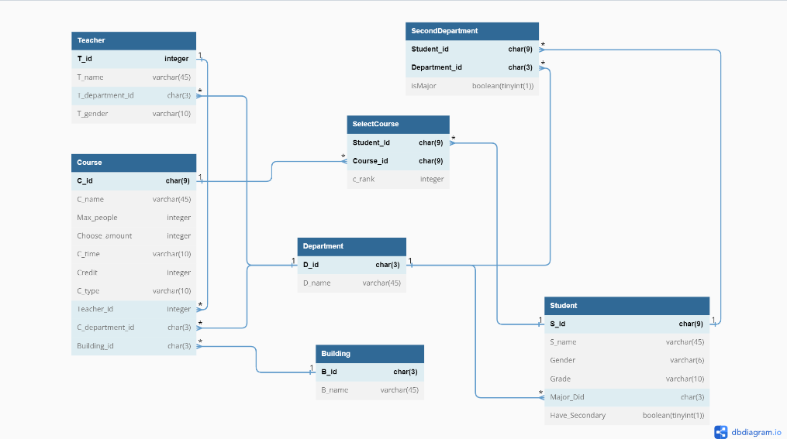

# 選課排序回報系統 1112_DBMS_PJ

根據當前所有學生的選課裝況，來判斷你能否選上該堂課
還有一些新增課程，選課狀態。

## Prerequisites

- python 
- MySQL
- Flask

# Flask
* 安裝套件 `pip install -r REQUIREMENT.txt`
* 啟動 `python index.py`
* http://localhost:5000/

## ER Model 

## Relational Schema

## Page

1. Read
    - /CourseSelectRecommendation
    - /Read/SelectCourse
    - /Read/Course
    - /Read/Student
    - /Read/Teacher
2. Create
    - /Create/DataSubmission
    - /Create/Course
    - /Create/Student
    - /Create/Teacher
3. Update
    - /PersonalData/Update
4. Delete
    - /Delete/SelectCourse
    - /Delete/Student
